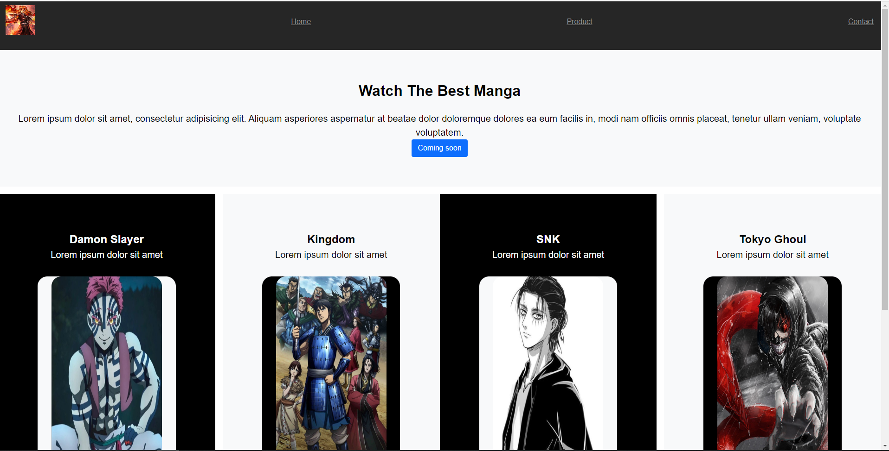

# Goals of this project

* Create a Landing page.

# How to use the code

* you just have to open the index.html file with a browser.
# Demo
* follow this link for see the demo of my page 😊 https://github.com/3npC0nf1g/First_Landing/deployments/activity_log?environment=github-pages

# ReadMe to complete ...
